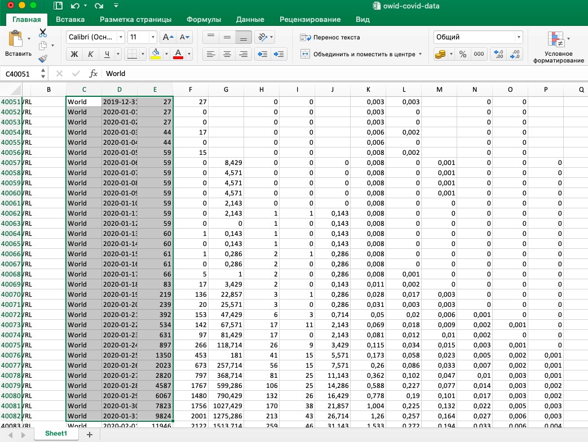
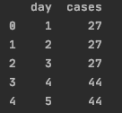
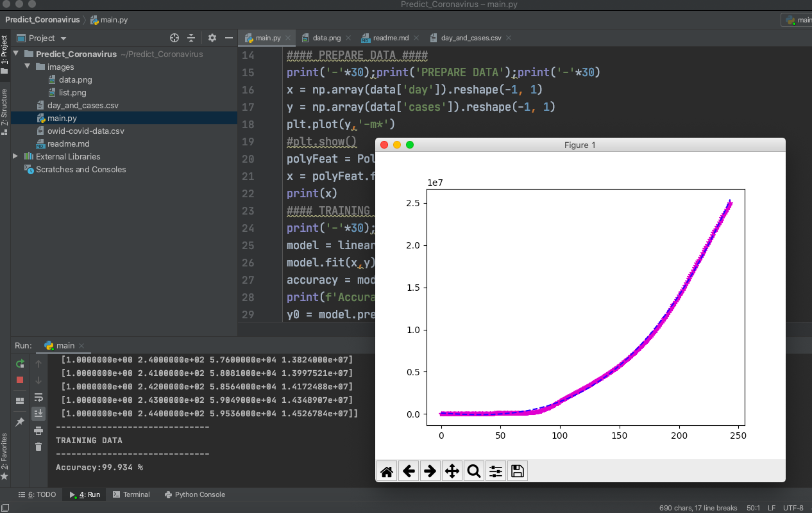
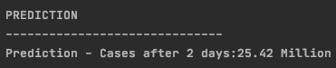
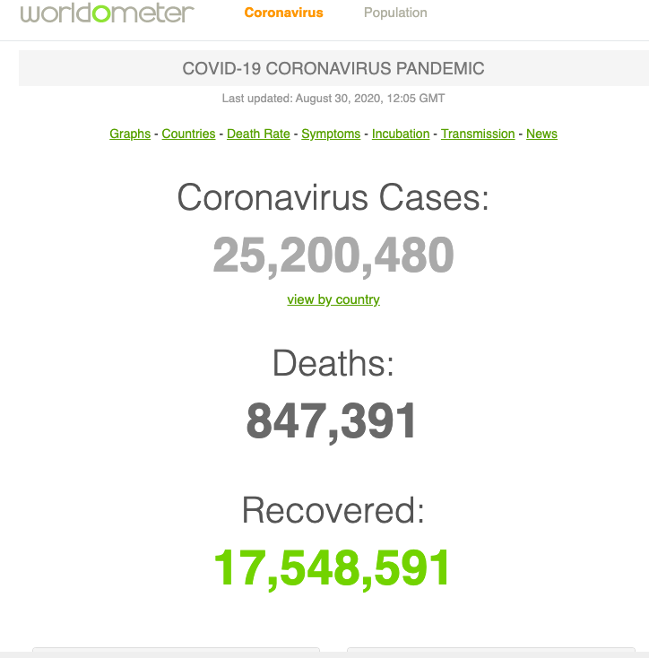

#Corona Virus Predictor using Polynomial regression!
Here we will use Polynomial regression to predict cases of infection. 
The dataset was taken from the ourworldindata.org `the link bellow` where I used columns of date and cases and make a new dataset day_and_cases


 Link: https://ourworldindata.org/coronavirus-source-data

- Import Libraries
```
import pandas as pd
from sklearn.preprocessing import PolynomialFeatures
from sklearn import linear_model
import numpy as np
import sklearn
import matplotlib.pyplot as plt
```
- Load data
```
data = pd.read_csv('day_and_cases.csv', sep=';')
data = data[['day','cases']]
print('-'*30);print('HEAD');print('-'*30)
print(data.head())
```
 
- Prepare data
```
print('-'*30);print('PREPARE DATA');print('-'*30)
x = np.array(data['day']).reshape(-1, 1)
y = np.array(data['cases']).reshape(-1, 1)
plt.plot(y,'-m*')
#plt.show()
polyFeat = PolynomialFeatures(degree=3)
x = polyFeat.fit_transform(x)
print(x)
```
- Training data
```
print('-'*30);print('TRAINING DATA');print('-'*30)
model = linear_model.LinearRegression()
model.fit(x,y)
accuracy = model.score(x,y)
print(f'Accuracy:{round(accuracy*100,3)} %')
y0 = model.predict(x)
```
 
 The purple line - plot of actual data.
 
 The blue line - plot of predicted data.
- Prediction
```
days = 2
print('-'*30);print('PREDICTION');print('-'*30)
print(f'Prediction - Cases after {days} days:',end='')
print(round(int(model.predict(polyFeat.fit_transform([[244+days]])))/1000000,2),'Million')

x1 = np.array(list(range(1,244+days))).reshape(-1,1)
y1 = model.predict(polyFeat.fit_transform(x1))
days = 15
print('-'*30);print('PREDICTION');print('-'*30)
print(f'Prediction - Cases after {days} days:',end='')
print(round(int(model.predict(polyFeat.fit_transform([[234+days]])))/1000000,2),'Million')

x1 = np.array(list(range(1,234+days))).reshape(-1,1)
y1 = model.predict(polyFeat.fit_transform(x1))
plt.plot(y1,'--r')
plt.plot(y0,'--b')
plt.show()
```
- Result

 
 
 